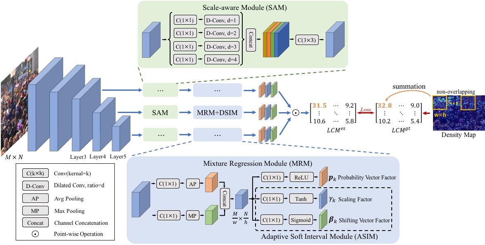
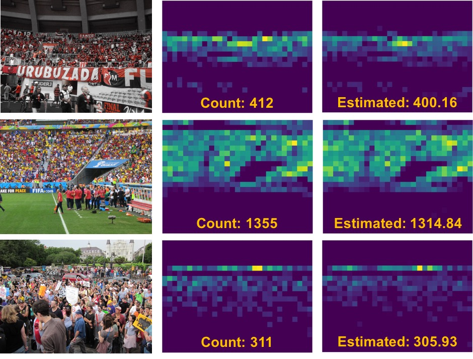

# ECCV2020: Adaptive Mixture Regression Network with Local Counting Map for Crowd Counting


### Introduction
In this work, we introduce a new learning target named local counting map, and
show its feasibility and advantages in local counting regression. Meanwhile, we
propose an adaptive mixture regression framework in a coarse-to-fine manner.
It reports marked improvements in counting accuracy and the stability of the
training phase, and achieves the start-of-the-art performances on several author-
itative datasets. For more details, please refer to our [arXiv paper](https://arxiv.org/abs/2005.05776).

### Framework


### Demo


### Getting Started
- Prerequisites
  - Python >= 3.5
  - Pytorch >= 1.0.1
  - other libs in ```requirements.txt```, run ```pip install -r requirements.txt```.

- Data Preparation
  - Download ```ShanghaiTech, UCF-QNRF, UCF_CC_50``` datasets from the official websites 
    and unzip them in ```./ProcessedData```.
  - Run ```cd ./datasets/XXX/``` and ```python prepare_XXX_mod64.py``` to resize images and generate training labels.
  - UCF-QNRF: [[home link](https://www.crcv.ucf.edu/data/ucf-qnrf/)], 
ShanghaiTech: [[home link](https://pan.baidu.com/s/1nuAYslz)], 
UCF-CC-50: [[home link](http://crcv.ucf.edu/data/ucf-cc-50/)]

- Pretrained Model (Only for Training)
  - Some Counting Networks (such as VGG, CSRNet and so on) adopt the pre-trained models on ImageNet.
    Download ```vgg16-397923af.pth``` from ```torchvision.models```.
  - Place the pre-trained model to ```./models/Pretrain_model/```. 
  - vgg16-397923af.pth : [download link](https://download.pytorch.org/models/vgg16-397923af.pth)

- Folder Tree
    ```
    +-- source_code
    |   +-- datasets
        |   +-- SHHA
        |   +-- ......
    |   +-- misc     
    |   +-- models
        |   +-- Prerain_Model
        |   +-- SCC_Model
        |   +-- ......
    |   +-- ProcessedData
        |   +-- shanghaitech_part_A
        |   +-- ......
    ```

### Models
QNRF-model (MAE/MSE: 86.6/152.1):

Google Drive: [download link](https://drive.google.com/open?id=1btZa7ltAwqQe0CDa41P67EtTdY0iJOfh),
Baidu Yun: [download link](https://pan.baidu.com/s/1humECw3oz4xRbWy5CaakZQ) (key: pe2r) 

### Demo Testing
- put test images in ```./demo_image```.
- run ```python demo.py```.
- results are saved at ```./demo_image/result```.

### Dataset Testing
- set the parameters (such as MODEL_PATH) in ```test_config.py```.
- run ```python test.py```.

### References
https://github.com/gjy3035/C-3-Framework
